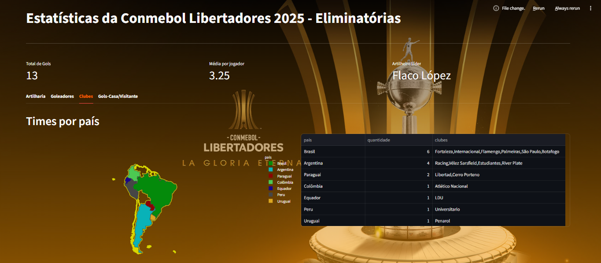
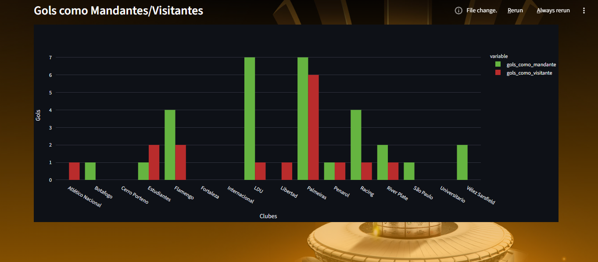
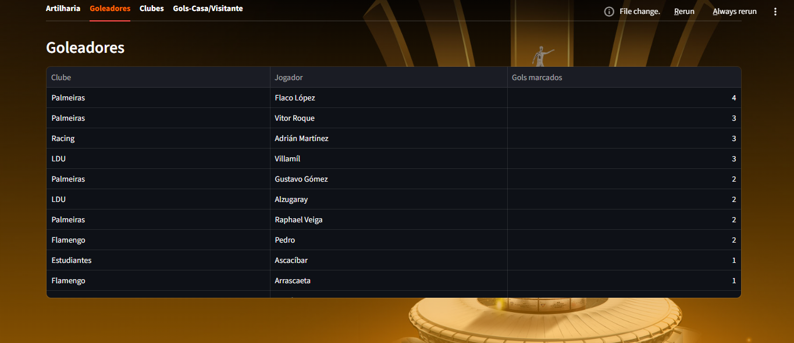
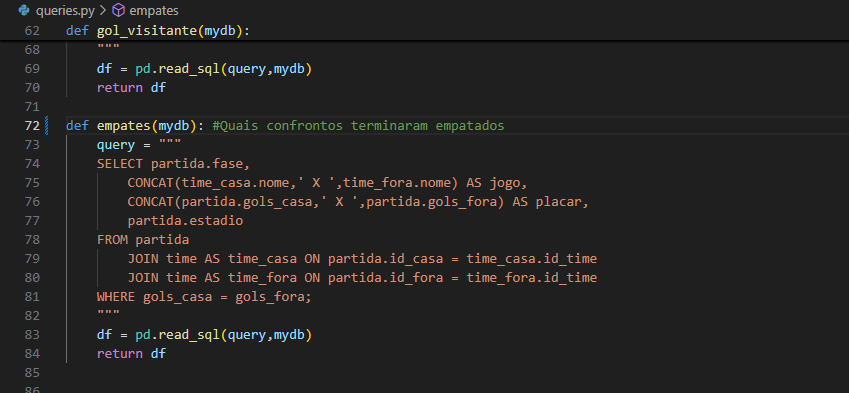

# Conmebol Libertadores 2025 – Dashboard Analítico

Dashboard interativo desenvolvido com **Streamlit**, **Plotly** e **MySQL**, apresentando estatísticas da fase eliminatória da Conmebol Libertadores 2025 (Oitavas de Final até Semifinais).

---

## Sobre o Projeto

Este dashboard foi criado para visualizar de forma clara e interativa diversas estatísticas da competição, incluindo:

- Artilharia da fase mata mata  
- Goleadores gerais da competição  
- Distribuição de clubes por país  
- Comparação de gols como mandante e visitante  

O projeto integra dados armazenados em um banco MySQL, processa via Pandas e exibe tudo em uma interface visual construída com Streamlit.

---

## Estrutura do Projeto

├── app.py<br>
├── queries.py<br>
├── db_connection.py<br>
└── .streamlit/<br>
└── config.toml


---

## Tecnologias Utilizadas

- **Python 3.10+**
- **Streamlit**
- **Plotly Express**
- **Pandas**
- **MySQL Connector**
- **MySQL Server**
- **Ambiente Virtual (venv)**

---

## Banco de Dados

O banco MySQL contém três tabelas principais:

- `time`  
- `jogador`  
- `partida`  

As consultas SQL estão organizadas no arquivo **queries.py**, facilitando manutenção e expansão.  
A conexão com o banco é gerenciada em **db_connection.py**.

---

## Como Executar o Projeto

### 1. Criar ambiente virtual
```bash
python -m venv venv
```

### 2. Ativar o ambiente

Windows:
```bash
venv\Scripts\activate
```

Linux/macOS:
```bash
source venv/bin/activate
```

### 3. Instalar dependências
```bash
pip install streamlit mysql-connector-python pandas plotly
```

### 4. Rodar o servidor
```bash
streamlit run app.py
```

## Funcionalidades Implementadas
### Artilharia
* Gráfico de barras com jogadores que mais marcaram no mata mata.
* Tabela estilizada com renomeação de colunas, ocultação de índice e aplicação de estilo.
* Goleadores da Competição
* Listagem completa dos jogadores, seus clubes e gols totais.
* Clubes por País
* Mapa interativo (Choropleth) para a América do Sul.
* Hover totalmente estilizado.
* Cores personalizadas para cada país.
* Lista de clubes agrupados por país usando GROUP_CONCAT.
* Gols Mandante vs Visitante
* Junção das duas consultas SQL em um dataframe consolidado.
* Gráfico comparativo em barras agrupadas.

## Personalizações Visuais

O projeto conta com:

* Tema customizado via .streamlit/config.toml

* Background com imagem e efeito overlay via CSS

* Estilização dos tabs e métricas

* Hover customizado no mapa (fonte, cor, alinhamento, moldura)

* Dataframes com formatação aplicada

## Organização das Queries

O arquivo queries.py contém funções específicas para:

* Artilheiros
* Times por país
* Gols como mandante
* Gols como visitante
* Jogadores por clube
* Média de gols por fase
* Empates

Essa divisão permite reuso e simplifica futuras alterações.

## Observações Importantes

É necessário que o servidor MySQL esteja em execução.

Ajuste as credenciais em db_connection.py conforme seu ambiente.

A página utiliza st.set_page_config(layout="wide") para melhor aproveitamento horizontal.

## Exemplos de Telas



